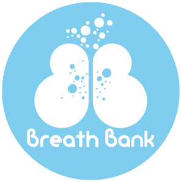

# Bienvenido a BreathBank

BreathBank es un proyecto de fin de grado que consiste en la creación de una aplicación móvil para fomentar el uso del control consciente y voluntario de la respiración.

## Contenidos

En este repositorio encontraremos diferentes carpetas y archivos:

-apk: contiene el archivo de ejecución de la aplicación de Android.
-doc: contiene la documentación del proyecto, anexos y memoria.
-Resto de carpetas y ficheros: contienen lo necesario para poder instalar, compilar y ejecutar el proyecto.

## Despliegue

Para poder ejecutar la aplicación desde un dispositivo Android, se debe de instalar en el móvil el archivo que se encuentra en la carpeta apk.

Es recomendable utilizar Android para asegurarse del rendimiento máximo de la aplicación, ya que mediante emuladores, pueden surgir problemas.

En cambio si su dispositivo es IOS, puede realizar el despliegue desde este enlace, , en el que podrás probar la aplicación en un emulador, Appetize.io.
